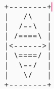

# Overview

Sample Android Application that takes one integer input based on drop down selections that represents the size of a Diamond to be drawn with keyboard characters.

Example of a Diamond of size 4.

Similar implementation to [Java for Android Week 1 Programming Assingment](https://github.com/yeongwei/AndroidSpecialisation-JavaForAndroid-Week1-ProgrammingAssignment) that uses just one Activity, `MainActivitiy.java`.